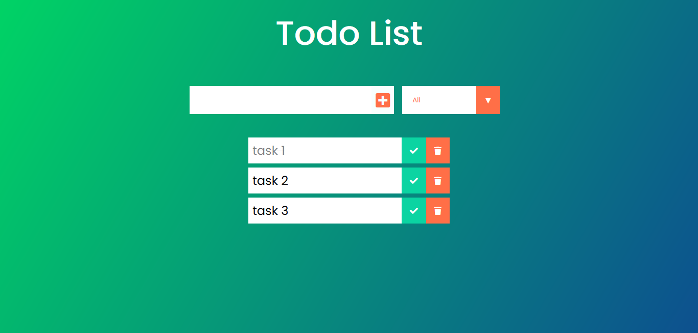
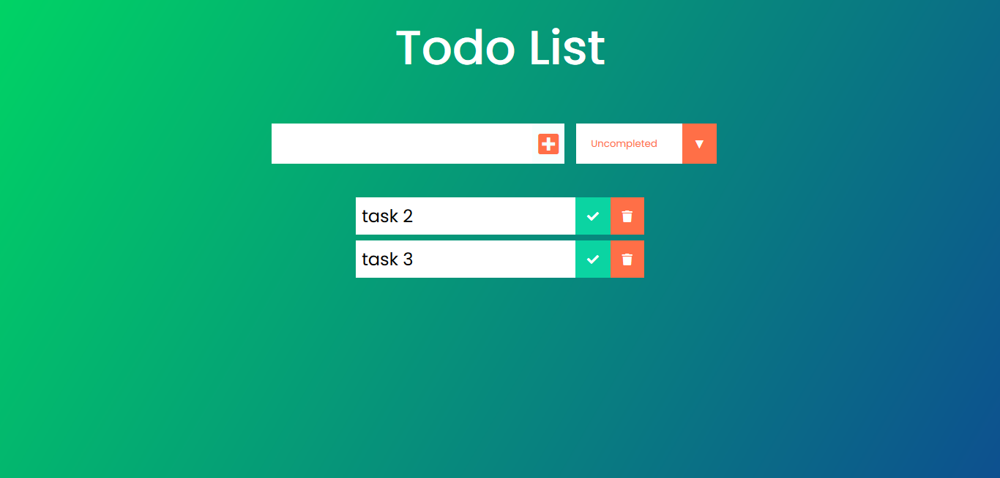
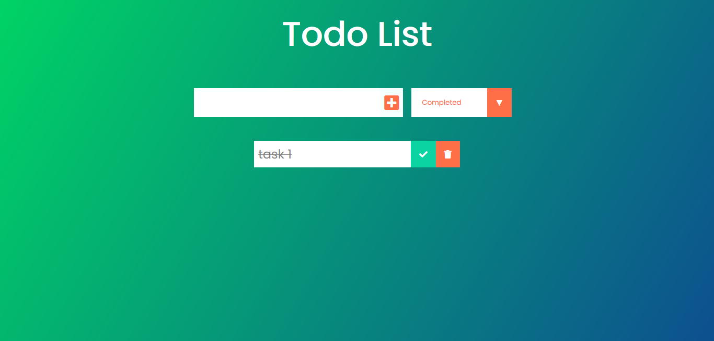

# Todo App

todo app built with React as a training, based on this tutorial (https://www.youtube.com/watch?v=pCA4qpQDZD8)
to test the code you need to run
1_ `npm install`
2_ `npm start` 

#sample

